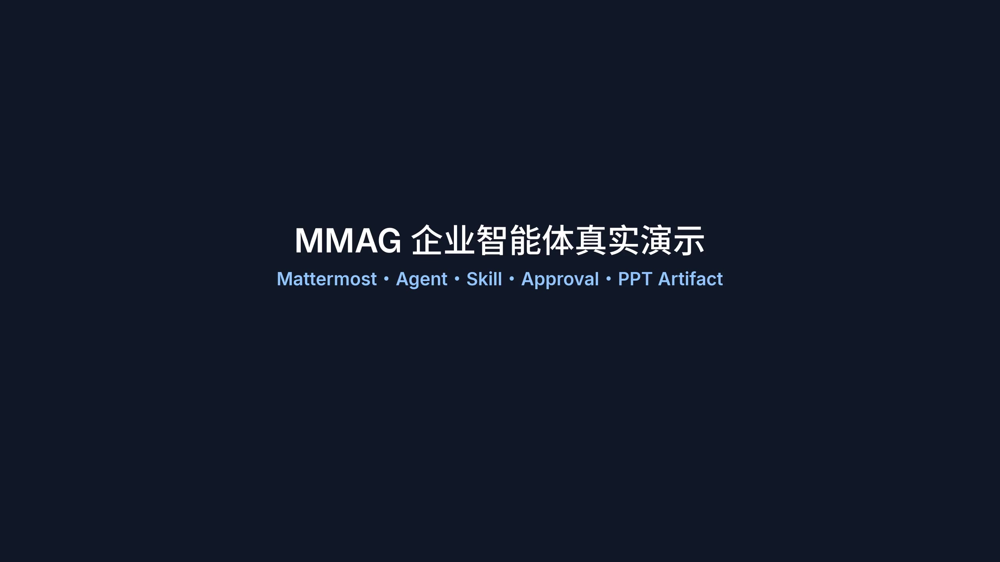
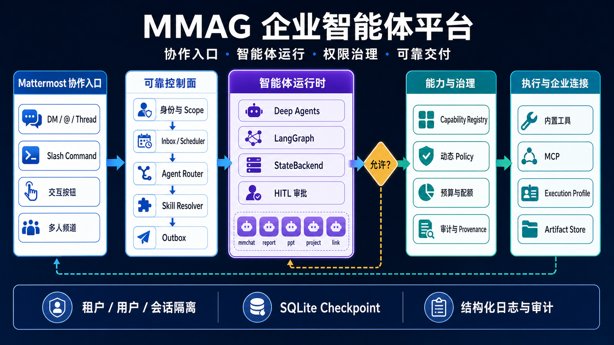

# MMAG

**运行在 Mattermost 中的企业智能体协作与治理平台。**

MMAG 不只是一个聊天 Bot。它把 Agent、Skill、Capability、Policy、人在回路、个人记忆和 Artifact
交付放进同一条可追溯链路，让数字员工能在真实团队会话中工作，同时保留身份隔离、权限边界和人工最终决策。

[](docs/assets/mmag-demo.mp4)

> [观看 2K 完整演示视频（2 分 46 秒）](docs/assets/mmag-demo.mp4)。视频通过真实 Mattermost、模型 API、
> 交互按钮和 PPT Artifact 链路录制，不是静态界面原型。

## 能做什么

当前主线覆盖四类企业协作场景：

| 场景 | 当前能力 | 状态 |
|---|---|---|
| 个人工作台 | 在 Bot DM 中管理个人 Skill、案例和长期记忆；运行 Skill 后可将优秀结果沉淀为案例 | 已实现主链 |
| 个人数字人 | 所有者发布数字人后，基于其授权资料为其他成员生成建议回复；高风险回复回到所有者批准 | 已实现受控主链 |
| 多人群聊 | 在频道或 Thread 中主动回答、研究、总结讨论，会议纪要保留来源 Post ID | 已实现 |
| 业务审批与交付 | Agent 完成前置总结和产物生成，真人通过按钮决定副作用，PPTX 与 PNG 预览经 Outbox 交付 | 已实现演示主链；验收、返工和业务报表仍在建设 |

此外，MMAG 已支持：

- DM、`@bot`、回复 Thread、普通频道消息和 `/mmag` Slash Command；
- 流式更新、统一结果卡片、真实附件预览，以及点击按钮后保留原消息和上下文；
- Agent/Skill YAML 自动注册、严格 Schema、版本与内容 Hash；
- Deep Agents 原生工具循环与 Skill 渐进披露；
- LangGraph SQLite checkpoint、`interrupt/resume` 和人在回路；
- 内置能力与 MCP Tool 的统一注册、动态资源级 Policy 和默认拒绝；
- Inbox/Outbox、同会话串行、跨会话并发、失败 DLQ 与幂等 replay；
- 个人身份、租户、频道、会话和 Artifact scope 隔离；
- 结构化日志、审计事件、关联 ID、敏感信息脱敏和运行 provenance。

## 核心模型

```text
Agent              = 谁来负责：职责、路由、上下文、预算和能力上限
Skill              = 怎样完成：工作方法、指令、模板和输入输出契约
Capability / Tool  = 具体动作：企业 API、MCP Tool 或平台受信执行入口
Policy             = 这一次是否允许：actor、scope、resource、审批和预算
Execution Profile  = 进程怎样运行：固定命令、资源限制、网络和产物出口
```

Agent 与 Skill 是多对多关系，但 Skill 必须依附于本次已选择的 Agent，且不能扩权：

```text
本次可用能力
= Agent allowlist
∩ Skill required / available optional capabilities
∩ 已启用的 MCP tools
∩ 当前请求 Policy
∩ Execution Profile command（涉及进程时）
```

## 运行架构



```text
Mattermost WebSocket / Slash Command / Action Callback
  → 身份与 Scope 解析
  → Durable Inbox / Conversation Scheduler
  → AgentRouter
  → SkillResolver + Personal Skill Overlay
  → Deep Agents Harness
      ├── LangGraph checkpoint / interrupt / resume
      ├── StateBackend + SkillsMiddleware
      └── 当前请求允许的 Capability Tools
  → CapabilityRegistry → Dynamic Policy → Approval / Executor
  → MCP / Governed Execution / Artifact Store
  → Durable Outbox / Presenter
  → Mattermost Thread、按钮与附件
```

这里没有第二套自研 Agent loop：**Deep Agents 是唯一模型 Harness，LangGraph 是唯一状态与人在回路
Runtime**。MMAG 自己负责的是企业应用层——Package、身份、权限、持久化、交付和审计。

Deep Agents 的 `StateBackend` 只保存当前 graph/thread 的小型工作文件和渐进披露的 Skill 资源；它不是
宿主文件系统，也不是 Artifact Store。PPTX、图片等二进制产物进入独立 Artifact Repository。

## 当前数字员工与 Skill

| Agent | 绑定 Skill | 职责 |
|---|---|---|
| `mmchat@2.2.2` | `web-research@1.2.1` | 默认 Mattermost 协同入口、个人/共享上下文和网络研究 |
| `link@2.0.1` | — | 确定性分析单个 URL，不启动不必要的模型循环 |
| `report@2.2.1` | `report@1.3.1`、`meeting@1.0.1` | 证据账本式研究报告与可追溯会议总结 |
| `ppt@3.1.2` | `slides@3.1.1` | 从受治理 Markdown 生成可编辑 PPTX、源文件和 PNG 预览 |
| `project@2.0.3` | `project@1.2.1` | 项目计划、状态简报、任务拆解和当前 Scope 内的本地任务跟踪 |

完整权限和交付边界见[数字员工清单](docs/WORKERS.md)。

## 触发与交互

- 在 DM、`@bot` 或回复 Bot Thread 中发送自然语言，会确定性进入处理链；
- 普通频道消息由默认 Agent 判断是否需要参与，不需要时保持安静；
- “分析这个链接”“生成竞品研报”“总结这个线程”“做一份 PPT”等自然语言先路由 Agent，再在其白名单
  内选择至多一个平台基础 Skill；个人请求还可叠加一个属于当前用户的 Personal Skill；
- `/mmag help`、`/mmag agents`、`/mmag skills [agent]` 和 `/mmag status [run-id]` 提供可发现入口；
- `/mmag summary today [--tasks]`、`summary --since HH:MM [--tasks]` 和
  `summary thread --root <post-id> [--tasks]` 提交受治理的频道总结；
- 需要副作用时优先展示签名、短时、一次性的批准/拒绝按钮；按钮不可用时仍可使用文本命令。

“我的 Skills”“我的案例”“我的记忆”等个人入口使用意图识别，不要求用户死记固定句式。交互按钮只更新
对应动作，不会用一行“操作成功”覆盖原卡片；终态会移除失效按钮并保留原始内容。

## 身份与数据隔离

MMAG 以 Mattermost 事件中的可信 `user_id`、`channel_id` 和成员关系建立执行上下文，不让 Prompt 或用户
文本自行声明身份。核心边界包括 `installation → tenant → owner → conversation`：

- 个人记忆、Personal Skill、WorkCase 和数字人草稿按 owner 存储在 SQLite 中；
- 频道知识和消息检索必须匹配当前 conversation/scope；
- 个人资产默认只在 Bot DM 中展示和修改，跨 owner 读取默认拒绝；
- 数字人只有显式发布的内容才能服务他人，高风险外发进入所有者审批；
- Artifact 在读取和交付时重新校验 scope、kind、路径、大小和 SHA-256；
- 同一个 Bot 可以并发服务多个用户，同一会话串行、不同会话并发，状态不会依赖进程内全局变量。

设计细节见 [ADR-0010](docs/adr/0010-mattermost-identity-scope-isolation.md)。

## YAML 注册 Agent、Skill 与 MCP

Agent 采用扁平 Package，版本保留在 Manifest 内，不创建垃圾 `versions/` 目录：

```text
agents/<name>/
  agent.yml
  system.md                  # 模型 Agent 才需要
  input.schema.json
  output.schema.json
  artifact.schema.json       # 确实产出 Artifact 时才需要
```

```yaml
api_version: mmag.ai/v1
kind: ManagedAgent
metadata:
  name: research
  version: 1.0.0
  description: 生成带来源的企业研究报告
spec:
  routing:
    priority: 80
    keywords: [研究报告, 竞品调研]
    scopes: ["mattermost:*"]
  capabilities:
    allow: [search_knowledge, analyze_link, mcp_crawl_search_text]
    deny: []
  skills:
    allow: [report@1.3.1]
    deny: []
  policy_ref: report@1.2.0
  model_policy_ref: reasoning-medium@1.0.0
```

Skill Package 位于 `skills/<name>/`，包含 `skill.yml`、`SKILL.md`、输入/输出 Schema 和真正需要的模板。
启动时 Registry 严格校验目录名、版本、引用、Schema、Prompt 变量、Capability 不扩权和 Package Hash；
任一 Package 非法都会使整批注册失败。

根目录 [`.mcp.json`](.mcp.json) 是 MCP Server、启停状态和平台工具清单的唯一配置源。Agent 在各自 YAML
中分配 `mcp_<server>_<tool>` 或受控通配模式，Skill 只能缩小。连接 Secret 必须使用环境变量引用，不能
写进 Agent、Skill、Policy 或 Prompt。

详细规则见 [Agent Package 指南](docs/AGENT_PACKAGES.md) 和
[Skill Package 指南](docs/SKILL_PACKAGES.md)。

## 快速开始

要求 Python 3.12+、[uv](https://docs.astral.sh/uv/)、Mattermost Bot Token，以及 Anthropic 或兼容模型
接口。PPT 演示链还需要 Node.js 和 `rsvg-convert`。

```bash
cp .env.example .env
# 编辑 .env：至少配置 MM_URL、MM_TOKEN、稳定的安装/租户 ID 和模型 API
uv sync --locked --dev
make discover
make run
```

推荐直接以 [`.env.example`](.env.example) 为配置清单。启用原生交互按钮和 Slash Command 时，还需在
Mattermost 平台创建对应集成，并配置：

```text
Interactive Message Request URL:
https://<public-host>/integrations/actions

Slash Command Request URL:
https://<public-host>/integrations/commands
```

本地服务默认监听 `127.0.0.1:8787`，公网入口应由可信 HTTPS 反向代理或 Cloudflare Tunnel 转发；同时设置
`MM_ACTION_CALLBACK_URL`、至少 32 bytes 的 `MM_ACTION_SIGNING_SECRET` 和 Mattermost 生成的
`MM_SLASH_COMMAND_TOKEN`。生产运行建议使用 `LOG_FORMAT=json`，由部署平台采集 stdout。

## PPT 与执行边界

Slides Skill 生成规范化 `slides.md` 并调用高层 `ppt.build`：

```text
Markdown Parser → Layout / Theme Compiler → PptxGenJS Renderer
                → editable PPTX + slides.md + PNG preview
```

同一份 Markdown 与 Theme 生成可编辑 PPTX 和图片预览，不依赖 LibreOffice/PDF 才能预览。文件外发默认
进入 LangGraph 审批，再由 Outbox 上传到 Mattermost。

平台的固定 argv `ProcessRunner`、Execution Profile、资源限制和 Artifact staging 已落地。为了跑通可信本地
Demo，还可显式设置 `MMAG_ALLOW_UNSAFE_LOCAL_EXEC=true` 开放完整宿主 Shell，并让每次执行进入审批；
**它不是生产 Sandbox**，不能仅靠“限制工作目录”阻止越权。生产环境仍应替换为真正隔离的 OCI/远程
Sandbox Backend，Agent Manifest 无权自行选择或降级 Runner。详见[受控执行平面](docs/EXECUTION.md)。

## 可靠性、安全与可观测性

- Policy 默认拒绝；未知 Agent、Capability、身份、Scope 或未匹配规则均拒绝；
- 每次 Tool 调用都经过 Capability Registry、资源级 Policy 和副作用前授权；
- URL 获取禁用环境代理和自动重定向，并对每一跳重新执行 DNS/IP SSRF 校验；
- MCP stdio 子进程只继承最小环境，不继承 Mattermost 和模型 Secret；
- Inbox、Outbox、审批 Action Token 和 Artifact commit 都有幂等边界；
- 普通日志记录稳定 `event/status`、UTC 时间和 `trace_id/run_id/thread_id/agent_ref/skill_ref`；
- Deep Agents 通过 LangChain 原生 Callback 记录模型与工具生命周期，但不记录消息正文、Prompt、完整参数、
  Provider 异常正文或 Secret；
- Agent、Skill、Prompt、Schema、Policy、Model Policy、MCP 配置和 Execution Profile 的版本/Hash 进入
  Run provenance，便于复现和审计。

运维、备份恢复和告警建议见[运维指南](docs/OPERATIONS.md)。

## 开发、评估与演示复现

```bash
make test       # 默认离线测试
make verify     # Ruff、coverage、mypy、wheel smoke
uv run mmag-eval --root evals validate
```

默认测试不访问 Mattermost、模型或公网。真实 E2E 必须显式开启外部门禁并使用专用测试账号：

```bash
MMAG_E2E_ENABLED=1 uv run mmag-eval --root evals run suites/smoke.yml \
  --profile profiles/staging-mattermost.yml --allow-external
```

演示视频可重复录制；脚本会创建真实多人讨论、运行 Personal Skill/数字人/会议总结/PPT 审批链，录制
Playwright 画面，并通过 MMX 逐句生成女声旁白、时间轴字幕和响度规范化音轨：

```bash
MMAG_E2E_ENABLED=1 scripts/record_mattermost_demo.sh --dry-run
MMAG_E2E_ENABLED=1 scripts/record_mattermost_demo.sh
```

完整依赖、断点续录和剪辑参数见[评估与录制指南](docs/EVALUATION.md)。

## 调试工具

开发时调试命令集，配置放在 `.env.debug`（从 `.env` 继承 `MM_URL` 和 `MM_TOKEN`，补充测试账号和频道 ID）。

```bash
make debug-status                       # 查看 bot 进程、已加载能力、最近运行
make debug-test MSG="测试消息"           # 发消息到 mmag-test → 忽略 ack/stream，等待终态回复并输出时间线
make debug-trace ID="trace-or-run-id"    # 查看 Agent 路由、Skill、模型、工具、Policy 和交付时间线
make debug-test MSG="创建任务..." JSON=1  # 输出机器可读报告，失败或超时返回非零退出码
make debug-trace ID="mattermost:<post-id>" JSON=1  # 精确 run 查询并聚合轮转日志
make debug-update                       # 收集 git log + CHANGELOG → 发到 Bugs 频道
make debug-collect                      # 拉取 Bugs 频道最近 20 条消息
make debug-reply POST_ID=xxx MSG="回复"  # 回复 Bugs 频道指定帖子（支持短 ID 前缀）
```

## 项目结构

```text
agents/                 # Agent Manifest、Prompt 与 Schema
skills/                 # Skill Manifest、SKILL.md、Schema 与按需资源
policies/               # 默认拒绝的 Policy-as-Code
model-policies/         # 平台模型路由、采样与输出预算
execution-profiles/     # 固定命令、Runner、资源和产物约束
evals/                  # 系统场景、Suite 与真实 E2E Profile
docs/                   # 架构、运维、Roadmap、ADR 与演示资产

src/mmag/
  application/          # Composition root、消息编排、Presenter 与交互
  agent_system/         # Agent 契约、Registry 与 Router
  agent_packages/       # Manifest 加载、Factory 和运行时契约
  skill_packages/       # Skill Registry、Resolver 与 Personal Skill 覆盖
  capabilities/         # Capability Spec、Registry、Policy binding 与 Executor
  runtimes/             # Deep Agents Harness、LangGraph 状态和原生 telemetry
  execution/            # Workspace Backend、Profile、Process 与 Artifact staging
  control_plane/        # Inbox、Outbox、Lifecycle、Approval 与 replay
  governance/           # Policy、Quota、Secret、日志与审计
  infrastructure/       # SQLite 等持久化实现
  evaluation/           # E2E Driver、断言和报告
  renderers/            # 平台受信的 PPT Renderer 与主题
```

旧 `agent.py`、`managed_agents.py`、`tools/`、全局 `prompts.yml`、Claude Agent SDK、自定义 Anthropic
客户端和手写 graph loop 均已删除，不保留运行时双轨兼容层。

## 当前边界与路线图

项目已跑通 Mattermost → Agent/Skill → 工具/审批 → Artifact/交付的真实主链，但还不等同于完整企业
生产闭环。当前最高优先级包括：

1. 用真正隔离的本地 OCI 或远程 Sandbox 替换 Demo 宿主 Shell；
2. 强制 Research → Presentation 只通过版本化、同 Scope 的 Artifact ref 交接；
3. 完成接受、驳回、返工、Feedback 和 Task 终态报表；
4. 补齐 Policy 全量审计、审计归档/防篡改和 Web/Desktop/Mobile 验收；
5. 为 Package 发布接入真实 eval 门禁和可回滚制品仓库。

实施状态以 [Roadmap](docs/ROADMAP.md) 为准，已知风险见[技术债](docs/TECH_DEBT.md)。

## 文档

- [产品定义](docs/PRODUCT.md)
- [AI Native 架构](docs/AI_NATIVE_REFACTORING.md)
- [Deep Agents 重构](docs/DEEP_AGENTS_REFACTORING.md)
- [Agent Package](docs/AGENT_PACKAGES.md)
- [Skill Package](docs/SKILL_PACKAGES.md)
- [数字员工清单](docs/WORKERS.md)
- [Mattermost 体验与集成](docs/MM_UX.md)
- [受控执行平面](docs/EXECUTION.md)
- [运维指南](docs/OPERATIONS.md)
- [评估体系](docs/EVALUATION.md)
- [架构决策记录](docs/adr/)

## License

MIT
