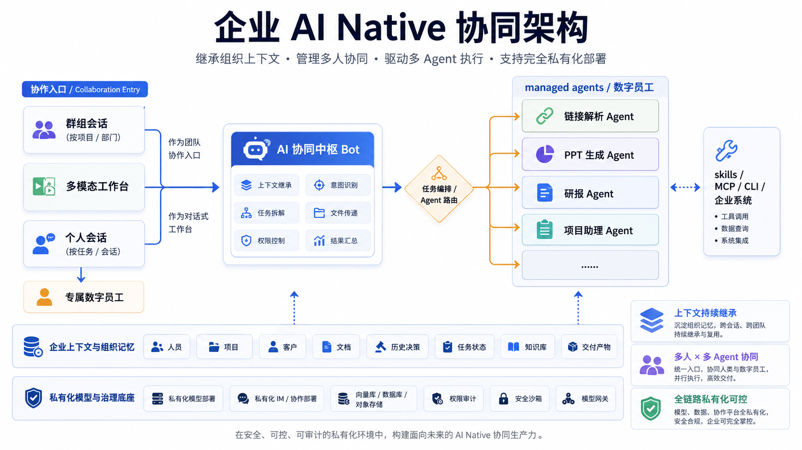
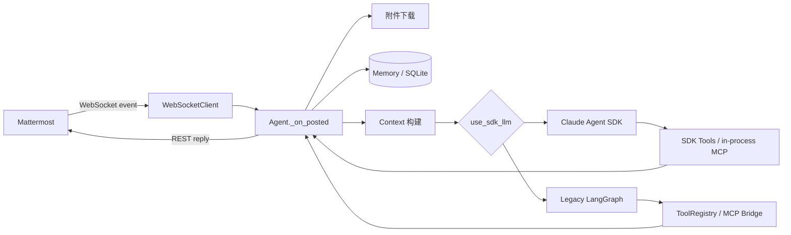
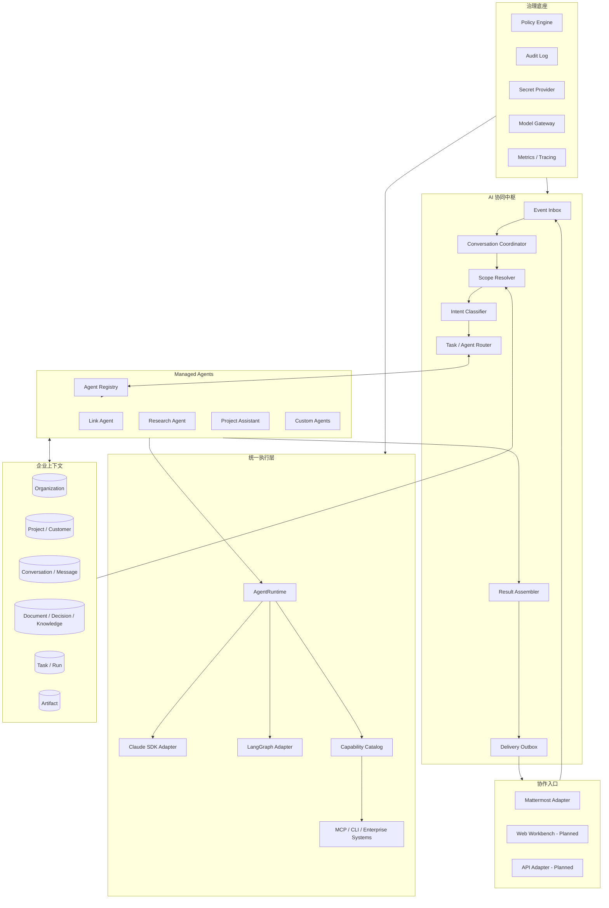
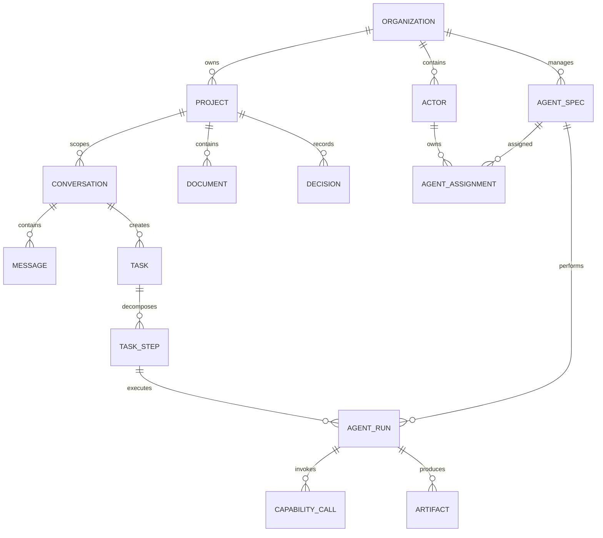

# mmag AI Native 协同架构重构方案

> 状态：Active / 分阶段实施中
> 基线日期：2026-07-31  
> 适用版本：mmag 0.1.x（当前 `main`）  
> 输入依据：当前代码、现有 Roadmap/Tech Debt、`ai_native.png` 架构图



### 实施进度

截至 2026-07-31，Phase 0 已完成第一批测试护栏和数据演进基础：

- 默认 pytest 不再收集 `tests/poc`；
- 真实 Mattermost、LLM 和公网测试统一标记为 `external`，默认不执行；
- 新增离线消息主链契约测试，覆盖消息持久化、显式路由、Runtime 和回复投递；
- 修复 Runtime 失败提示被发送层吞掉的问题；
- 测试数据库改用内存 SQLite；
- 已建立版本化 SQLite migration，覆盖新库初始化、旧字段补齐、旧消息/FTS 迁移、幂等、失败回滚和未来版本拒绝；
- `Memory` 不再负责建表和历史 schema 升级；业务消息与 FTS 写入也具备失败回滚；
- Secret 日志、文件路径和 MCP 工具已经改为显式安全边界，默认离线基线为 `194 passed, 2 deselected`。

尚未完成：CI、coverage、类型检查、wheel 资源打包和 Runtime/Capability 统一。

下一步不直接拆分 `Agent` 或引入多 Agent，而是按以下依赖顺序推进：

| 顺序 | 实施包 | 核心产出 | 为什么先做 |
|---|---|---|---|
| 1 | 收口 Phase 0 工程门禁 | CI、coverage 基线、类型检查基线、wheel smoke test | 让后续每次重构都有自动回归门禁 |
| 2 | Runtime 契约 | `RunRequest`、`AgentResult`、`AgentRuntime` 与统一错误模型 | 先稳定调用边界，再替换内部实现 |
| 3 | Capability 单一来源 | `CapabilitySpec`、执行器、一个只读能力的双 Runtime binding | 用垂直切片验证工具不再重复定义 |
| 4 | Runtime 适配与切换 | SDK/LangGraph Adapter、默认路径和回退策略 | 消除上层对两套 Runtime 细节的判断 |
| 5 | 入口与执行解耦 | `InboundEvent`、按会话分区的执行队列、Outbox | 在统一执行协议后再引入并发和恢复 |

可执行任务、边界和验收标准以 [`ROADMAP.md`](./ROADMAP.md) 为准；本文档保留目标架构和设计理由。

## 1. 文档目的

本文档用于回答三个问题：

1. mmag 当前真实架构是什么，已经具备哪些能力；
2. 若以“企业 AI Native 协同架构”为目标，系统缺少哪些关键边界；
3. 如何在保持现有 Mattermost Bot 可用的前提下，分阶段重构成支持多人、多 Agent、企业上下文和私有化治理的协同平台。

本文档是架构方向和迁移计划，不代表其中的目标模块已经实现。

### 1.1 本次重构的范围

- Mattermost 协作入口解耦；
- 消息接收、任务执行与结果投递解耦；
- LLM Runtime 和工具系统统一；
- 企业上下文、任务状态与交付物建模；
- Managed Agent 注册、路由和协作协议；
- 权限、审计、模型访问和私有化治理边界；
- 支撑以上变化的测试、迁移和可观测性基础。

### 1.2 暂不包含

- 立即拆成微服务；
- 一次性实现 PPT、研报、项目助理等全部数字员工；
- 一次性替换 SQLite 或 Mattermost；
- 大规模前端工作台建设；
- 在缺少契约测试前进行破坏性重写。

## 2. 执行摘要

当前 mmag 已具备 Mattermost 实时接入、上下文窗口、持久化消息、用户画像、团队知识、摘要、多模态、工具调用、MCP 和两种 LLM Runtime。它是一个功能较丰富的单 Bot Agent。

但当前系统还不是“AI 协同平台”：

- `Agent` 同时承担入口、应用编排、上下文、策略、执行和输出，是系统的事实中心；
- Claude Agent SDK 与 Legacy LangGraph 是两条不同的运行链路；
- 内置工具在两套 Runtime 中重复定义，已经出现行为漂移；
- WebSocket 事件处理串行等待完整 LLM/工具链，无法安全支撑多人并发；
- Memory 以频道消息为核心，尚未建立组织、项目、客户、任务、决策、Agent Run、交付物和审计等企业上下文；
- 当前“链接分析”等能力是工具，不是可独立配置、授权、审计和路由的 Managed Agent。

因此本次重构的首要目标不是增加更多 Agent，而是先建立统一的控制面：

```text
统一事件 → 会话协调 → 上下文解析 → 任务路由 → Agent 执行 → 结果汇总 → 审计投递
```

推荐顺序：

1. 建立关键链路契约测试和数据库迁移机制；
2. 统一 Runtime 与 Capability 协议；
3. 将消息接收和任务执行解耦；
4. 建立企业上下文与任务/产物模型；
5. 引入 Agent Registry 和 Router；
6. 最后完善治理与私有化部署能力。

## 3. 对 AI Native 架构图的理解

架构图表达的重点不是“系统中存在很多 Agent”，而是以下四层形成闭环。

| 架构层 | 核心职责 | 对 mmag 的含义 |
|---|---|---|
| 协作入口 | 群组会话、多模态工作台、个人会话 | Mattermost 是第一个 Adapter，未来可增加 Web/API，不应侵入业务内核 |
| AI 协同中枢 | 上下文继承、意图识别、任务拆解、权限、文件、结果汇总 | 应成为稳定控制面，而不是负责所有专业工作的超级 Agent |
| Managed Agents | 链接、PPT、研报、项目助理等数字员工 | 每个 Agent 应声明能力、输入输出、权限、预算、作用域和运行状态 |
| 企业上下文与治理 | 人员、项目、客户、文档、决策、任务、知识、产物、模型和审计 | 上下文必须有明确作用域和访问策略，不能只依赖频道消息与 Prompt |

“专属数字员工”可理解为一个 Agent Profile 与用户、会话或项目的绑定；“受管数字员工”则是平台注册、路由、授权和审计的 Agent 实例。

## 4. 当前真实架构

### 4.1 当前运行链路



入口在 [`cli.py`](../src/mmag/cli.py)，主要依赖由 [`Agent.__init__`](../src/mmag/agent.py) 直接构造。WebSocket、REST、Memory、两套 LLM、两套工具和 MCP 生命周期全部汇聚到 `Agent`。

### 4.2 当前已有能力

| 能力 | 当前实现 | 评价 |
|---|---|---|
| Mattermost 接入 | `ws_client.py` + `client.py` | 已可用，但协议层和业务执行未隔离 |
| 显式召唤 | @、DM、thread 硬规则 | 可保留为中枢路由规则 |
| 群聊自主响应 | LLM 输出 `<SILENT>` | 可用，但故障和沉默语义混在一起 |
| 上下文窗口 | `working_memory` + `_build_context` | 以频道为中心，耦合 MM/Memory/Prompt |
| 长期记忆 | SQLite 消息、FTS、画像、知识、摘要 | 有价值，但 Repository 和作用域尚未分离 |
| 多模态 | 图片、文本附件转 content blocks | 已具备入口侧能力 |
| Legacy Agent Loop | Anthropic API + LangGraph | 一条完整但与 SDK 重叠的 Runtime |
| SDK Agent Loop | Claude Agent SDK | 当前默认路径，有独立工具与权限实现 |
| 内置工具 | 消息、知识、链接、用户、文件等 | 两套定义，存在漂移风险 |
| MCP | Legacy MCP Bridge + SDK in-process server | 两条链路未形成同一能力目录 |
| 日志追踪 | 全局 `TraceContext` | 串行可用，并发不安全 |

### 4.3 主要架构问题

#### A. `Agent` 是 Facade God Object

[`agent.py`](../src/mmag/agent.py) 当前超过 1200 行，同时负责：

- 依赖构造和生命周期；
- Mattermost 事件过滤与解析；
- 历史 backfill；
- 附件下载与内容转换；
- 消息持久化与用户画像；
- 触发判定；
- System Prompt 与上下文构建；
- LLM Runtime 选择；
- typing、ack、回复与错误降级。

直接按文件大小拆分只能移动代码，不能解决控制权、数据所有权和依赖方向问题。

#### B. Runtime 与工具系统双轨

- [`llm.py`](../src/mmag/llm.py) 使用 LangGraph 和 `ToolRegistry`；
- [`sdk_llm.py`](../src/mmag/sdk_llm.py) 使用 Claude Agent SDK，忽略传入的 `tools/tool_registry`；
- [`tools/builtin.py`](../src/mmag/tools/builtin.py) 和 [`sdk_tools.py`](../src/mmag/sdk_tools.py) 重复声明工具；
- 工具参数上限、结果格式化和来源增强也存在重复；
- Legacy MCP 注册到 `ToolRegistry`，SDK 默认路径未消费这条注册链路。

这不是普通 Adapter，而是两套行为不同的系统。

#### C. WebSocket 被业务执行阻塞

[`WebSocketClient._dispatch`](../src/mmag/ws_client.py) 直接等待 `_on_posted`。一次消息会串行经历附件下载、SQLite、摘要、LLM、多轮工具和 REST 回复。

结果包括：

- 一个慢任务阻塞所有后续事件；
- 无法做到跨频道并发、同会话保序；
- 缺少排队、背压、超时、取消和任务恢复；
- 重启后无法判断任务是未开始、运行中、已完成还是已投递。

#### D. 请求状态是全局可变状态

- `ToolContext.current_post` 是所有请求共享的单槽；
- `TraceContext` 使用全局可变字典；
- `working_memory` 由 `Agent` 直接维护；
- 全局 `config` 会在 SDK 初始化失败时被运行期修改。

引入并发后可能出现工具读取了另一条消息的上下文、trace 串线、配置状态漂移等问题。

#### E. Memory 还不是企业上下文平台

[`memory.py`](../src/mmag/memory.py) 的 schema、migration 与 CJK FTS 预处理已经下沉到 [`infrastructure/sqlite`](../src/mmag/infrastructure/sqlite)，但它仍同时承担消息、URL 缓存、画像、知识和摘要等 Repository 职责。当前主要作用域仍是 `channel_id`，缺少：

- organization / tenant；
- team / department；
- project / customer；
- document / decision；
- task / task step / agent run；
- artifact / delivery；
- permission binding / audit event。

#### F. 安全与治理没有统一入口

当前 SDK 路径有工具黑名单和路径检查，但仍存在需要优先解决的边界：

- MCP 工具按前缀整体放行；
- 路径判断采用字符串前缀匹配；
- MCP 子进程继承完整进程环境；
- 不同 Runtime 使用不同权限链路；
- 缺少按用户、组织、项目、Agent 和数据资源的策略决策；
- 缺少完整的工具调用、模型调用和产物访问审计。

## 5. 重构目标与原则

### 5.1 目标

1. 入口可扩展：Mattermost 只是一个 Adapter；
2. 多人并发：跨会话并发，同一会话有序；
3. 多 Agent 可管理：可注册、发现、路由、授权、暂停和审计；
4. 上下文可继承：组织、项目、客户、会话和任务作用域明确；
5. 能力只定义一次：同一 Tool/Skill/MCP 能被不同 Runtime 使用；
6. 执行可恢复：任务、步骤和投递有持久状态；
7. 全链路可控：模型、数据、工具、产物和权限均可治理；
8. 渐进迁移：每一步都保持 Bot 可运行、可回滚。

### 5.2 设计原则

- **中枢是控制面**：负责理解、授权、路由、协调与汇总，不承担全部专业执行；
- **Agent 不等于 Tool**：Tool 是原子能力，Agent 是带策略、状态和结果契约的执行者；
- **上下文显式传递**：禁止依赖全局 `current_post` 等隐式请求状态；
- **策略先于执行**：每次模型、工具、数据访问先经过统一 Policy；
- **状态先于并发**：先定义任务状态、幂等和恢复，再扩大并发；
- **模块化单体优先**：先稳定边界，出现独立伸缩或隔离需求后再拆服务；
- **代码即事实**：目标能力未完成前必须在文档中标注为 Planned。

## 6. 目标架构



### 6.1 协作入口层

职责：

- 将 Mattermost/Web/API 输入转换为统一 `InboundEvent`；
- 解析平台身份，但不做业务路由；
- 负责平台协议、重连、限流、附件下载/上传；
- 将结果从统一 `OutboundMessage` 转换为平台消息。

不负责：Prompt 构建、Agent 选择、任务执行、知识检索。

### 6.2 协同中枢

协同中枢是一组确定性应用服务，不是一个 Prompt：

- `ConversationCoordinator`：会话保序、并发和生命周期；
- `ScopeResolver`：解析组织、项目、客户、会话和用户作用域；
- `IntentClassifier`：识别聊天、查询、研究、生成产物等意图；
- `TaskPlanner`：把复杂请求转换为任务或 DAG；
- `AgentRouter`：按意图、权限、成本、可用性选择 Agent；
- `ResultAssembler`：汇总多个 Agent 输出、引用、附件和错误；
- `DeliveryService`：通过 Outbox 幂等投递。

### 6.3 Managed Agent

建议 Agent 声明以下元数据：

```yaml
name: research-agent
version: 1
accepted_intents:
  - research
  - compare
  - report
runtime: claude-sdk
model_policy: reasoning-medium
capabilities:
  - web.search
  - web.fetch
  - document.read
memory_scopes:
  - organization
  - project
  - conversation
permission_policy: research-readonly
timeout_seconds: 600
budget:
  max_model_calls: 12
  max_tool_calls: 30
result_schema: ResearchReport
```

Managed Agent 必须具备：

- 明确输入、输出和错误结构；
- 可配置能力白名单；
- 上下文读取和写入范围；
- 模型、超时、重试和成本预算；
- 执行记录和审计信息；
- 取消、降级和健康状态。

### 6.4 Capability Catalog

Capability 是 Tool、Skill、MCP 或企业 API 的统一抽象。一个能力只能有一个事实定义：

```python
@dataclass(frozen=True)
class CapabilitySpec:
    name: str
    description: str
    input_schema: dict
    output_schema: dict
    risk_level: str
    required_permissions: tuple[str, ...]
    timeout_seconds: int
    handler: CapabilityHandler
```

不同 Runtime 只负责把它转换成对应协议：

```text
CapabilitySpec
  ├── Anthropic Tool Schema Adapter
  ├── Claude SDK @tool Adapter
  ├── MCP Adapter
  └── Internal API Adapter
```

## 7. 核心领域模型

### 7.1 请求级契约

```python
@dataclass(frozen=True)
class RunContext:
    trace_id: str
    tenant_id: str
    actor_id: str
    conversation_id: str
    project_id: str | None
    source_event_id: str
    permissions: frozenset[str]
    locale: str
```

`RunContext` 必须由入口和 Scope Resolver 构建，显式传给中枢、Agent、Capability 和审计服务。禁止继续使用全局单槽保存当前消息。

### 7.2 任务状态

```text
PENDING → QUEUED → RUNNING → SUCCEEDED
                   │    ├── FAILED
                   │    ├── TIMED_OUT
                   │    └── CANCELLED
                   └── WAITING_APPROVAL
```

每次 Agent 执行对应一个 `AgentRun`，每个工具调用对应一个 `CapabilityCall`。回复是否成功投递由独立 `Delivery` 状态记录。

### 7.3 上下文作用域

上下文读取顺序建议为：

```text
当前消息
  → 当前 thread / conversation
  → 当前 task / project
  → 当前 customer / department
  → organization shared knowledge
```

作用域越大，检索优先级越低，权限要求越高。任何上下文片段都应保留来源、更新时间、可见范围和置信度。

### 7.4 关键实体关系



## 8. 关键运行流程

### 8.1 普通群聊消息

```text
1. Mattermost Adapter 接收 posted event
2. 标准化为 InboundEvent，按 event_id 幂等入 Inbox
3. Conversation Worker 按 conversation_id 取出事件
4. Scope Resolver 解析用户、组织、项目和权限
5. Context Assembler 构建最小必要上下文
6. Intent Classifier 判断无需响应 / 中枢直接回答 / 创建任务
7. Agent Router 选择 AgentSpec
8. Runtime 执行，Capability 调用逐次经过 Policy
9. Result Assembler 汇总文本、来源和产物
10. Outbox 幂等投递到 Mattermost
11. 持久化 Run、调用记录、成本和审计事件
```

### 8.2 复杂任务与多 Agent 协作

复杂请求不应由一个 Agent 无限调用工具。Task Planner 产生受限任务图：

```text
用户请求“整理竞品并生成汇报”
  ├── Research Agent：采集和核验资料
  ├── Analysis Agent：结构化比较
  └── Presentation Agent：生成交付物
                         ↓
                   Result Assembler
```

每个步骤使用结构化输入输出；中枢只传递必要上下文和 Artifact 引用，避免复制全部对话。

### 8.3 专属数字员工

个人会话中的专属 Agent 通过 `AgentAssignment` 决定：

- 绑定用户、项目或会话；
- 继承哪些组织上下文；
- 能使用哪些 Capability；
- 是否允许产生外部副作用；
- 哪些行为需要人工审批。

## 9. 权限、安全与治理

### 9.1 统一策略模型

每次执行都应形成如下策略输入：

```text
Subject：当前用户 / Agent
Action：read / search / call / write / deliver
Resource：消息 / 项目 / 文件 / MCP 工具 / 企业系统
Context：组织、会话、任务、时间、风险级别
```

策略结果：

- `ALLOW`：允许；
- `DENY`：拒绝并记录原因；
- `REQUIRE_APPROVAL`：等待人工确认；
- `ALLOW_WITH_REDACTION`：脱敏后允许。

### 9.2 必需治理能力

- MCP Server 和 Capability 显式白名单；
- 子进程最小环境变量注入；
- 文件路径使用真实父子关系判断，不使用字符串前缀；
- URL 访问统一复用 SSRF、防重定向和响应大小限制；
- Secret Provider，不把凭据放入 Prompt、日志或通用 RunContext；
- 模型网关统一处理模型路由、限流、重试、成本和内容策略；
- 审计记录用户、Agent、模型、工具、数据作用域、输入摘要、输出摘要和结果；
- 写操作、外发、删除、审批等高风险能力默认需要更强策略。

## 10. 建议代码结构

迁移期采用模块化单体：

```text
src/mmag/
├── bootstrap.py
├── domain/
│   ├── conversation.py
│   ├── context.py
│   ├── task.py
│   ├── agent.py
│   └── capability.py
├── application/
│   ├── collaboration_hub.py
│   ├── conversation_coordinator.py
│   ├── context_assembler.py
│   ├── task_planner.py
│   ├── agent_router.py
│   ├── result_assembler.py
│   └── delivery_service.py
├── agents/
│   ├── registry.py
│   ├── link_agent.py
│   ├── research_agent.py
│   └── project_assistant.py
├── runtimes/
│   ├── base.py
│   ├── claude_sdk.py
│   └── langgraph.py
├── capabilities/
│   ├── catalog.py
│   ├── executor.py
│   ├── policy.py
│   └── adapters/
├── ports/
│   ├── inbound.py
│   ├── outbound.py
│   ├── repositories.py
│   ├── model_gateway.py
│   └── audit.py
├── infrastructure/
│   ├── mattermost/
│   ├── sqlite/
│   ├── mcp/
│   ├── llm/
│   └── observability/
└── config/
```

依赖方向应保持：

```text
infrastructure/adapters → application → domain
```

领域层不得导入 Mattermost、Anthropic SDK、Claude Agent SDK、MCP 或 SQLite。

## 11. 分阶段迁移计划

### Phase 0：建立安全基线

目标：重构前先证明关键行为。

工作项：

- [x] 建立隔离的 test suite，PoC 和真实服务测试不进入默认集合；
- [x] 增加首条离线 `Message → Route → Runtime → Reply` 主链契约测试；
- [ ] 补齐附件、工具、多轮、重试和幂等场景；
- [x] 引入数据库 schema version 和正式 migration；
- [ ] 建立 CI：ruff、pytest、coverage、类型检查；
- [ ] 修复 wheel 未包含运行资源的问题；
- [x] 校正文档与当前代码的版本漂移。

退出标准：

- 默认测试不访问真实 Mattermost/LLM/公网；
- 关键链路测试稳定通过；
- 旧数据库升级有自动化测试和回滚方案；
- CI 可作为后续重构门禁。

### Phase 1：统一 Runtime 与 Capability

目标：消除 SDK/Legacy 双轨业务差异。

工作项：

- 定义 `AgentRuntime`、`RunRequest`、`AgentResult`；
- 定义单一 `CapabilitySpec` 和 `CapabilityExecutor`；
- 从同一 Capability 生成 SDK、Anthropic 和 MCP binding；
- 统一错误、超时、重试、来源和审计结构；
- MemoryCompactor 通过 Runtime Port 调用模型；
- 选定默认 Runtime，另一套仅作为 Adapter/回退；
- 删除重复工具实现。

退出标准：

- 同一能力只存在一份 schema、handler 和策略；
- 两个 Runtime 通过同一组契约测试；
- 上层不再判断 SDK/Legacy 特有异常；
- MCP 能力对不同 Runtime 的可见性一致。

### Phase 2：解耦入口和执行

目标：支持安全并发和任务恢复。

工作项：

- 引入 `InboundEvent`、Inbox 和 Outbox；
- 使用 `conversation_id` 分区：同会话串行、跨会话并发；
- 将附件、摘要和长任务移出 WebSocket 读取循环；
- 引入不可变 `RunContext` 和 `ContextVar` 日志上下文；
- 删除全局 `current_post`；
- 增加幂等、背压、超时、取消和优雅关闭；
- Mattermost REST 迁移为有 timeout/retry 的异步 Client。

退出标准：

- 慢 LLM 不阻塞其他频道事件；
- 同一会话内消息顺序稳定；
- 重启后可恢复未完成或未投递任务；
- 并发测试不存在上下文和 trace 串线。

### Phase 3：企业上下文与持久状态

目标：从频道记忆升级为有作用域的上下文平台。

工作项：

- 拆分 Message、Profile、Knowledge、Summary Repository；
- 新增 Organization、Project、Customer、Document、Decision；
- 新增 Task、TaskStep、AgentRun、Artifact、Delivery、AuditEvent；
- 建立 Scope Resolver 与 Context Assembler；
- 上下文记录来源、权限、时间和置信度；
- 为 SQLite 建立事务、连接和并发访问策略。

退出标准：

- 可按组织/项目/会话安全检索上下文；
- 每次 Agent 执行和产物均可追踪；
- Context Assembler 不依赖 Mattermost 具体结构；
- Memory 大类不再拥有所有表和业务逻辑。

### Phase 4：Managed Agent 与路由

目标：让数字员工成为平台的一等公民。

工作项：

- 实现 `AgentSpec`、`ManagedAgent`、`AgentRegistry`；
- 实现基于意图、权限、作用域、成本和健康度的 Router；
- 将 `analyze_link` 升级为第一个 Link Agent；
- 实现 Agent handoff 和结构化 Artifact；
- 再逐步加入 Research Agent、Project Assistant、Presentation Agent；
- 引入 AgentAssignment 支持个人/项目专属数字员工。

退出标准：

- 新 Agent 可通过注册配置接入，而不是修改核心 `Agent`；
- Agent 的能力、权限、预算和输出均可检查；
- 多 Agent 任务有明确步骤和状态；
- 单个 Agent 失败不会破坏整个会话处理。

### Phase 5：治理与私有化生产能力

目标：达到企业可控、可审计、可运维。

工作项：

- Policy Engine、审批节点和敏感数据脱敏；
- Secret Provider 与最小权限执行环境；
- Model Gateway、模型策略、配额和成本统计；
- metrics、distributed tracing、告警和运行看板；
- 数据保留、归档、删除和备份恢复策略；
- 私有化部署拓扑、升级和灾备文档；
- 安全审计和压力测试。

## 12. 测试策略

### 12.1 测试分层

| 层级 | 覆盖内容 | 是否允许真实外部服务 |
|---|---|---|
| Unit | Domain、Router、Policy、Context 选择 | 否 |
| Contract | Runtime、Capability、Repository、Adapter | 否，使用 fake server |
| Integration | SQLite/MCP/Mattermost 协议组合 | 仅本地容器或 fake |
| E2E | 完整消息到回复链路 | 独立环境，显式执行 |
| PoC/Benchmark | 真实模型、成本、延迟、SDK 行为 | 显式执行，不进入默认 CI |

### 12.2 必须锁定的关键场景

- 重复 WebSocket event 不会重复回复；
- 同会话保序、跨会话并发；
- SDK 和 LangGraph 对相同 Capability 的行为一致；
- Capability 权限拒绝不会被 Runtime 绕过；
- LLM 限流、超时和内容拒绝有不同错误语义；
- Agent 成功但投递失败时可重试，不重复执行 Agent；
- SQLite migration 中断后不会产生半迁移状态；
- Agent handoff 不泄漏其他项目或用户上下文；
- 审计记录不包含原始 Secret。

## 13. 可观测性与验收指标

建议建立以下基础指标：

- `inbound_events_total` / `inbound_lag_seconds`；
- `conversation_queue_depth`；
- `agent_runs_total{agent,status}`；
- `agent_run_duration_seconds`；
- `model_calls_total{model,status}`；
- `model_tokens_total` / `model_cost_total`；
- `capability_calls_total{capability,status}`；
- `policy_decisions_total{decision}`；
- `deliveries_total{channel,status}`；
- `context_retrieval_duration_seconds`；
- `dropped_events_total` / `duplicate_events_total`。

架构迁移不能只用“文件变小”作为成功标准，应关注：

- 新增 Agent 是否无需修改中枢；
- 新增 Runtime 是否无需复制工具；
- 单个任务是否可追踪、取消和恢复；
- 权限是否可解释；
- 多频道并发是否不串上下文；
- 失败是否能被用户和运维感知。

## 14. 主要风险与控制措施

| 风险 | 影响 | 控制措施 |
|---|---|---|
| 在测试基线前移动大量代码 | 回归无法定位 | Phase 0 先建契约测试 |
| 直接拆微服务 | 运维复杂度超过收益 | 模块化单体优先 |
| 新旧 Runtime 长期共存 | 行为继续漂移 | 统一协议并明确淘汰窗口 |
| 先上多 Agent | 放大重复、并发和权限问题 | Runtime/Capability/Queue 先行 |
| 数据模型一次性过度设计 | 迁移成本过高 | 从 Task/Run/Artifact/Scope 最小集合开始 |
| Prompt 承担权限和路由 | 不可验证、可被绕过 | 确定性 Policy 和 Router |
| SQLite 并发策略不清 | 锁、损坏或数据不一致 | 单写者/事务边界/Repository 测试 |
| 文档愿景被误认为现状 | 错误决策 | 明确 Current/Planned 状态并持续更新 |

## 15. 下一步实施思路

### 15.1 总体方法

后续重构遵循六条原则：

1. **契约先于搬文件**：先用输入、输出、错误和测试定义边界，再移动实现。
2. **适配先于替换**：现有 SDK 和 LangGraph 先包进统一 Adapter，不在同一迭代重写其内部逻辑。
3. **垂直切片先于批量迁移**：先迁移一个只读 Capability，跑通 schema、执行、来源和审计，再迁移其余工具。
4. **外部行为保持稳定**：Phase 1 不改变 Mattermost 触发方式、回复格式和数据库格式。
5. **数据演进必须可验证**：所有持久化变化继续使用 forward-only migration，并覆盖旧库升级和失败回滚。
6. **保持模块化单体**：当前优先建立清晰模块边界，不提前引入微服务、分布式队列或复杂控制面。

### 15.2 实施包 A：收口 Phase 0（下一步）

目标：把本地已通过的基线变成每次变更都必须通过的工程门禁。

实施内容：

- 增加 CI，执行 Ruff、默认离线 pytest、coverage 和宽松模式类型检查；
- 首次采集 coverage，只对核心模块设置可持续提高的最低阈值；
- 构建 wheel 后在隔离环境执行导入、CLI 和 `prompts.yml` 加载 smoke test；
- 将 external/PoC 测试保留为显式任务，不让密钥和公网依赖进入默认 CI；
- 补齐当前主链尚缺的附件、工具、多轮、失败重试和重复事件测试。

验收标准：

- 干净环境中一条命令可完成 lint、测试、类型检查和构建验证；
- 默认 CI 不访问真实 Mattermost、LLM 或公网；
- wheel 安装后无需仓库源码目录即可启动并加载运行资源；
- 门禁失败能明确指出是代码质量、行为、类型还是打包问题。

### 15.3 实施包 B：建立 Runtime 契约

目标：让应用层只依赖统一执行协议，不感知 Claude Agent SDK 或 LangGraph 细节。

实施内容：

- 定义不可变 `RunContext`、`RunRequest` 和结构化 `AgentResult`；
- 定义 `AgentRuntime` Protocol，以及 timeout、rate-limit、rejected、unavailable 等统一错误；
- 用现有实现包装 SDK/LangGraph Adapter，先保持行为不变；
- 将 `MemoryCompactor` 等模型调用方改为依赖 Runtime Port；
- 冻结两条现有路径的行为差异，形成默认 Runtime 和淘汰策略 ADR。

验收标准：

- `Agent` 不再直接判断 Runtime 私有异常或返回结构；
- 两个 Adapter 通过同一组 contract tests；
- 切换 Runtime 不改变消息路由和回复投递接口。

### 15.4 实施包 C：Capability 单一来源

目标：消除 `tools/builtin.py` 与 `sdk_tools.py` 的 schema、handler 和格式化逻辑重复。

实施内容：

- 定义 `CapabilitySpec`、`CapabilityResult`、权限/副作用元数据和执行器；
- 选择 `get_channel_info` 作为首个只读切片；
- 从同一 Capability 生成 ToolRegistry、SDK 和后续 MCP binding；
- 统一来源信息、超时、错误和审计字段；
- 验证后再逐个迁移其余内置工具，最后删除重复实现。

验收标准：

- 同一能力只有一份输入 schema 和 handler；
- SDK/LangGraph 对相同输入产生等价结果；
- 写能力能被明确标记，并为后续审批策略保留边界。

### 15.5 实施包 D：入口与执行解耦

目标：解决 WebSocket 读取循环等待完整 LLM/工具链的问题，为多人并发和任务恢复打基础。

实施内容：

- 定义与 Mattermost 无关的 `InboundEvent`；
- 以 `conversation_id` 分区，同会话串行、跨会话并发；
- 将执行结果写入 Outbox，再由投递器发送；
- 建立事件幂等、背压、取消、超时和优雅关闭语义；
- 删除全局 `current_post`，使用不可变上下文贯穿日志和能力调用。

验收标准：

- 慢任务不阻塞其他频道；
- 重复事件不重复执行或回复；
- Agent 成功但投递失败时只重试投递；
- 并发测试中不存在会话、文件和 trace 串线。

### 15.6 后续阶段

入口与执行稳定后，再依次推进：

1. 拆分 Message/Profile/Knowledge/Summary Repository，建立最小 Scope、Task、Run、Artifact 模型；
2. 引入 Agent Registry 和确定性 Router，将 Link Agent 作为首个 Managed Agent；
3. 最后增加策略审批、模型网关、审计、保留策略和私有化运维能力。

在 Runtime、Capability 和执行队列稳定前，不新增第二个 Managed Agent，也不进行微服务拆分。

## 16. 待确认的架构决策

以下问题需要在实施前形成 ADR：

1. Claude Agent SDK 是否作为唯一长期 Runtime，LangGraph 是回退还是最终删除；
2. 任务状态先落 SQLite，还是直接使用可独立部署的队列/数据库；
3. organization/project/customer 与 Mattermost team/channel 的映射规则；
4. Agent Router 首期采用确定性规则、LLM 分类还是混合方案；
5. 哪些 Capability 被定义为有副作用，哪些必须人工审批；
6. Artifact 使用 Mattermost 文件、对象存储还是二者结合；
7. 私有化部署需要支持的模型提供商、数据库和 Secret 系统；
8. 企业上下文的保留、删除、脱敏和跨项目共享规则。

## 17. 与现有文档的关系

- [`README.md`](../README.md)：当前产品能力和运行方式；
- [`ROADMAP.md`](./ROADMAP.md)：现有版本里程碑；
- [`TECH_DEBT.md`](./TECH_DEBT.md)：已有问题清单；
- 本文档：AI Native 目标架构、演进原则和迁移顺序。

后续一旦正式采用本方案，应同步修订 Roadmap：将“0.2.0 架构清理”从按大文件拆分，调整为“契约基线 → Runtime/Capability 统一 → 执行解耦 → Context → Managed Agent”的渐进路线。

## 18. 结论

mmag 当前的优势是已有真实协作入口、工具、记忆和多模态能力，不需要推倒重来。真正需要改变的是系统控制权：

```text
从：一个 Bot 对消息做完整处理
到：一个协同中枢协调上下文、任务、Agent、能力和治理
```

只有先完成 Runtime、Capability、RunContext 和任务状态的统一，链接、研报、PPT、项目助理等数字员工才能成为可复用、可并发、可授权、可审计的企业能力，而不是继续堆积在单个 `Agent` 中的功能分支。
