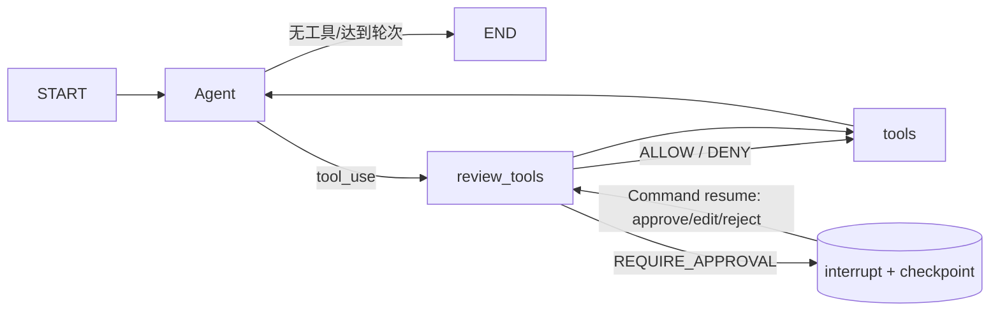

# ADR-0005：LangGraph 原生 Human-in-the-loop

- 状态：Accepted
- 日期：2026-07-31
- 修订：2026-08-01（checkpoint 与业务数据库分离）

## 图结构

`review_tools` 只做无副作用的授权计算。LangGraph 恢复节点时会从节点开头重新执行，因此审批单创建、消息发送和 Capability handler 都不能放在 `interrupt()` 之前。Runtime 返回中断后，应用层才创建审批单并发送通知。

## 持久化与恢复

- `RunContext.run_id` 是稳定 `thread_id`，Mattermost 事件使用 `mattermost:<post_id>`。
- `langgraph-checkpoint-sqlite` 使用 `CHECKPOINT_DB_PATH` 指向独立文件；记忆、control plane 和 Artifact
  metadata 继续使用 `MEMORY_DB_PATH`。启动时若两者解析为同一路径则失败关闭。
- 分离文件避免 LangGraph 默认异步 checkpoint 与业务 Capability 并发写入时争抢同一 SQLite 写锁，
  同时保留官方 saver 的默认持久化行为。
- `AgentResult.status=waiting_approval` 携带结构化 interruptions。
- 业务审批单同时持久化原始 CapabilityContext；恢复时还原原消息、频道和 actor，避免审批命令覆盖副作用前置条件。
- 审批恢复后，原 Task/AgentRun 从 `waiting_approval` 回到 `running`，完成后才进入 `succeeded`。
- 已批准的写 Capability 返回错误时，本次 Run 不再向模型暴露该 Capability；错误不等于副作用确定未发生，
  因此自动重试或再次申请同一写入均被禁止，后续重试必须由新的用户请求触发。
- 测试覆盖暂停前无副作用、批准、修改、拒绝，以及关闭并重建 Runtime 后从 SQLite 恢复。
