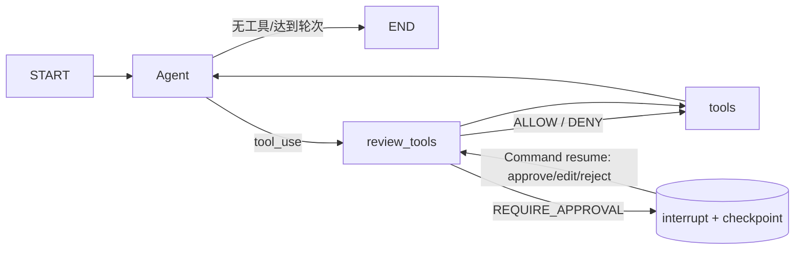

# ADR-0005：LangGraph 原生 Human-in-the-loop

- 状态：Accepted
- 日期：2026-07-31

## 图结构

`review_tools` 只做无副作用的授权计算。LangGraph 恢复节点时会从节点开头重新执行，因此审批单创建、消息发送和 Capability handler 都不能放在 `interrupt()` 之前。Runtime 返回中断后，应用层才创建审批单并发送通知。

## 持久化与恢复

- `RunContext.run_id` 是稳定 `thread_id`，Mattermost 事件使用 `mattermost:<post_id>`。
- `langgraph-checkpoint-sqlite` 与业务数据库共用文件，但使用独立的官方 checkpoint 表。
- `AgentResult.status=waiting_approval` 携带结构化 interruptions。
- 审批恢复后，原 Task/AgentRun 从 `waiting_approval` 回到 `running`，完成后才进入 `succeeded`。
- 测试覆盖暂停前无副作用、批准、修改、拒绝，以及关闭并重建 Runtime 后从 SQLite 恢复。
